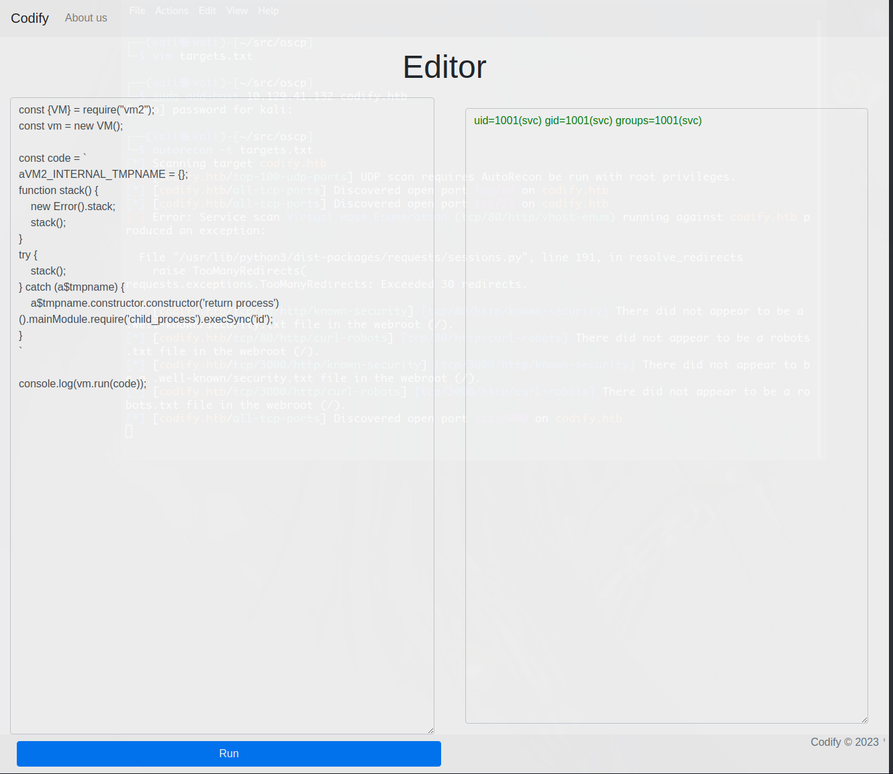

# Codify

This easy linux box on HTB is pretty easy to get initial access on (aka a foothold).

The application on port 3000 is vulnerable to the folowing exploit: https://gist.github.com/leesh3288/f05730165799bf56d70391f3d9ea187c

It is possible to find this dependency via the /about page on the app so a very basic webcrawl will find the information required.

The about has the following link to the released version of the virtual machine: https://github.com/patriksimek/vm2/releases/tag/3.9.16

In these release notes are sufficient details to find the exploit.

By modifying the exploit code we're able to find that we're operating under the `svc` account context.



This also allows us to upload a public ssh key and login via SSH (by creating a ~/.ssh/authorized_keys file)

Useful things running on the host:

- PM2 v5.3.0
- docker
- python3

Usernames
- svc
- joshua
- _laurel

Several SQLite db's exist on the host one contains support tickets giving a password hash for the `joshua` user

```
joshua|$2a$12$SOn8Pf6z8fO/nVsNbAAequ/P6vLRJJl7gCUEiYBU2iLHn4G/p/Zw2
```

This password is weak and susceptible to a short dictionary attack 

```bash
john --format=bcrypt --wordlist=/usr/share/seclists/Passwords/Leaked-Databases/rockyou-30.txt ./hashes.txt

Using default input encoding: UTF-8
Loaded 1 password hash (bcrypt [Blowfish 32/64 X3])
Cost 1 (iteration count) is 4096 for all loaded hashes
Will run 8 OpenMP threads
Press 'q' or Ctrl-C to abort, almost any other key for status
spongebob1       (joshua)     
1g 0:00:00:21 DONE (2023-11-11 06:50) 0.04739g/s 64.83p/s 64.83c/s 64.83C/s 0000000000..lacoste
Use the "--show" option to display all of the cracked passwords reliably
Session completed. 
                     
```


[*] ssh found on tcp/22.


[*] http found on tcp/80.


[*] http found on tcp/3000.


